<h1 style="font-size: 1.6em;">What is somatic well-being practice?</h1>

A Somatic well-being practice session consists of laying down in a comfortable position, followed by a guided exercise to bring the nervous system into the parasympathetic and encourage feelings of safety in the body. I will then guide you to feel emotions present in the body, which will be the focal point of the practice. We will use parts work, shadow work and emotional fluidity techniques.

Over time I have leaned more into [IFS therapy](https://en.wikipedia.org/wiki/Internal_Family_Systems_Model) as the main modality in the session, however I still draw from other modalities and blend them in lightly.

<!-- This is the culmination of what has worked for me to increase a sense of well-being and developing a nurturing resource of internal love or "Deep Okayness". During the session I will be drawing from different modalities such as [IFS therapy](https://en.wikipedia.org/wiki/Internal_Family_Systems_Model), shadow work and meditation to tailor the session to your needs. 

Some sessions will be IFS-dominant, some will be focused on the moment by moment sensations in the body and feeling through difficult emotions, while some will involve a cathartic emotional release through movement or anger work. -->

<h1 style="font-size: 1.6em;">Who are you and how do you work with clients?</h1>

</img>

For the last few years I've predominately made a living from Software Engineering and while that's been a fulfilling career, I've been consistently obsessed with the inner workings of the mind and how to live a good life. 

I used to have a lot of self-doubt, worry incessantly and compare myself to my peers. But I was deeply curious and explored each affliction like a detective. For many years I devoured books and courses, experienced altered states of consciousness and sought out wisdom wherever I could find it. I tried many healing and embodiment modalities; [IFS therapy](https://en.wikipedia.org/wiki/Internal_Family_Systems_Model), breathwork, dance and more. I trained with world-class coaches like [Joe Hudson](https://artofaccomplishment.com/) who helped me dissolve my inner critic. I healed my nervous system using a [breathwork app](https://othership.onelink.me/loJo/anita).

Along the way I learned that many of my afflictions stemmed from my lack of self-love. Somewhere deep in my psyche, unbeknownst to me, I didn’t like myself. That’s where the self-doubt and everything else stemmed from. So I went on a 3-year journey to find [persistent self-love](/self-love). You can read more about the story [here](/self-love).

Eventually, in the summer of 2022, something clicked in me and I started to feel well-resourced and drawn to holding space for others. Slowly I started to hold IFS sessions for friends and in October-December 2022, I got to put this into practice by running regular 1:1 sessions at a residency in Berlin; combing IFS and nervous system regulation.

I have been offering 1:1 IFS sessions professionally since May 2023. I am not a psychotherapist or a certified coach. However, I have completed IFS therapy training from IFSCA and I have done many courses over the years that don't come with official certifications. So far I have completed over 450 hours of these sessions.

<!-- <h1 style="font-size: 1.6em;">What are the benefits of this work?</h1>

Self-love is a nurturing source of internal love that helps soften the harsh aspects of being a human in this world.

Working towards self-love which in my experience involves learning to feel one's emotions and regulate one's nervous system, helps with the following:
- dissolving or lessening the inner critic and self-doubt
- lessening procrastination and perfectionism
- feeling less anxious or less numb
- better connection and improved interpersonal abilities
- getting [out of a triggered state](https://twitter.com/neats29/status/1612453371251769347?s=20) or recovering from it quickly
- getting closer to a [secure attachment style](https://twitter.com/neats29/status/1684959585977634816?s=20)

You can read more about my framework for self-love which informs this coaching practice [here](/self-love-framework). -->
<!-- 
Here's what two of my favourite tweeters say about achieving self-love:

<a href="https://twitter.com/sashachapin/status/1482799699333550082?s=20">
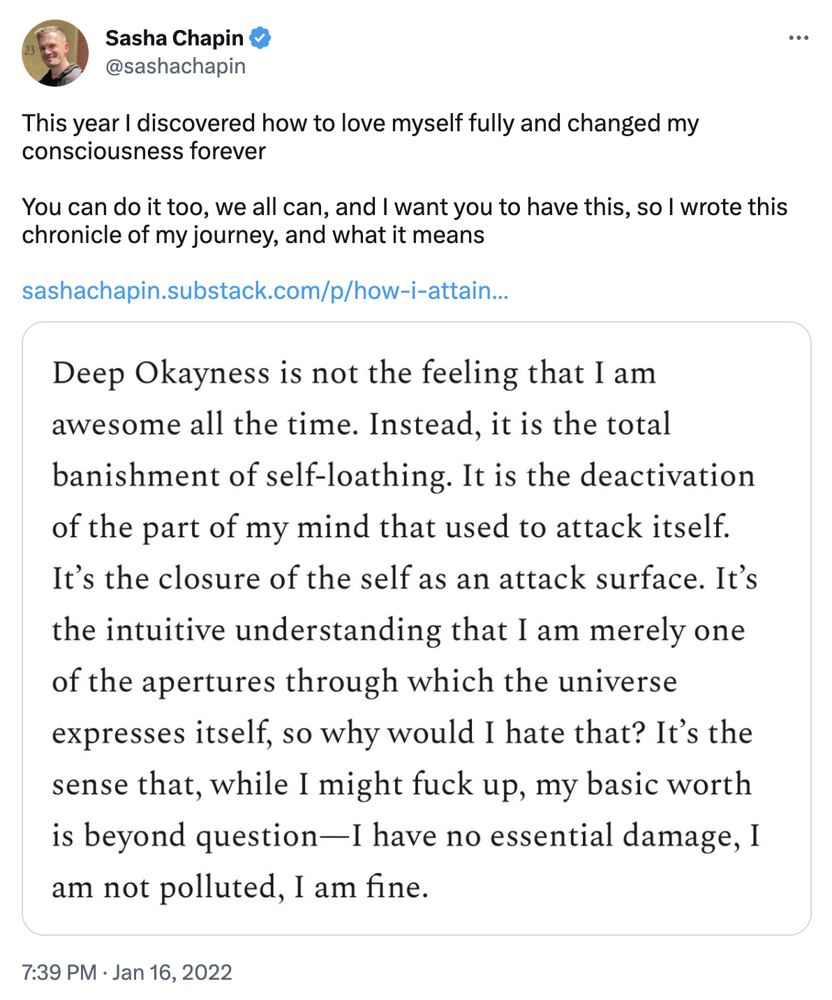
</img>
</a>

<a href="https://twitter.com/nickcammarata/status/1459740265862684680?s=20">
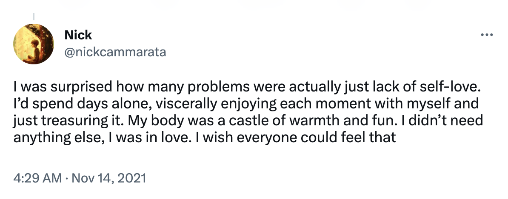
</img>
</a> -->

<h1 style="font-size: 1.6em;">Testimonials</h1>

> "anita is one of the best facilitators i have worked with. she made it easy to trust her process so i could focus on what was going on inside of me. i was grateful to have her help in guiding my attention, and especially her use of breathwork. months later i still think back to what she helped me discover in our sessions and use it for making decisions in life" — [Mycelium Mage](https://twitter.com/myceliummage)

> "After following Anita's journey into self-love and nervous system regulation for a while now, I finally had the opportunity to experience what she's learned, and it was really, really nice. Going into it I was pretty jittery and didn't know what to expect, but she held such a warm space and a kind presence and it helped me understand what she's moving towards. I left the session feeling much more in tune with my body, and what it meant to love myself, and to use the breath and my feelings to take me deeper into that experience. I've been continuing to use what I learned in that session since, practicing box breathing and making space for my feelings and showing them affection." — [Anansi](https://twitter.com/s0ulDirect0r)

> "Anita has a really special energy. She is so warm, loving, attentive, intelligent, and clearly passionate about this work. I felt very held and cared for in our session, in which she blended IFS therapy, breathwork, and light touch into her own unique format. I think she's a perfect fit for healing work." - [Jane Miller](https://twitter.com/joespurpleshirt)

> "There's a story that some of us who have met Anita tell others: when you are speaking with her it feels like she will listen and accept anything and everything you have to say. It's something you can't force or fake. Her countenance, persence, and empathy gives you permission and space to feel into where you are right now. Her self-love coaching sessions is the epitome of this because she is there with you to inquire where you are and allow whatever needs to pass through, pass through you. I no longer have to be scared or lost in discovering things about myself anymore, knowing Anita will be there when I need her to be." — [Minnow Park](https://twitter.com/minnowpark)

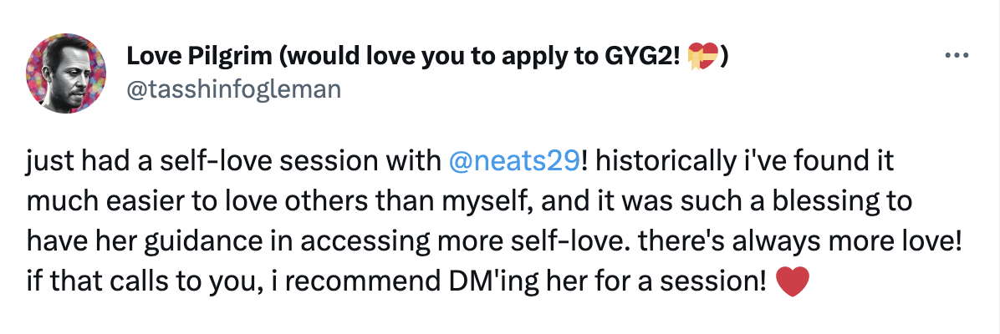
</img>

</img>

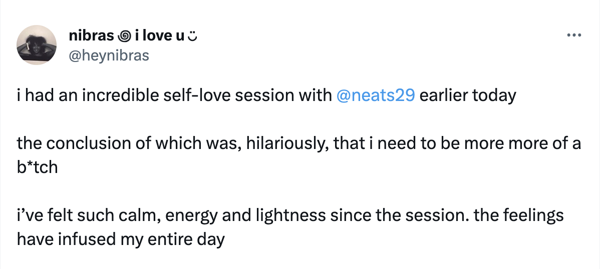
</img>

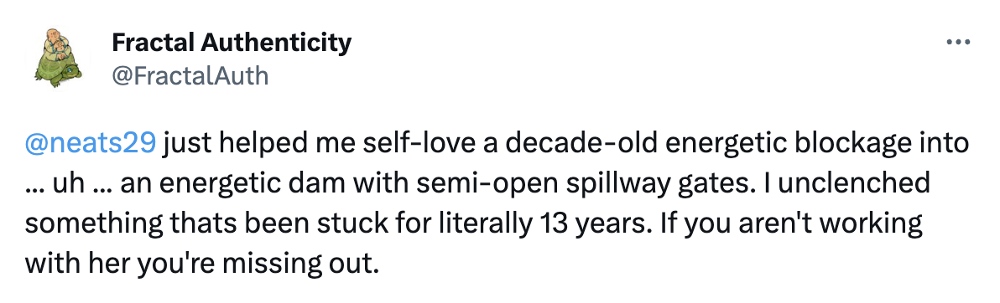
</img>

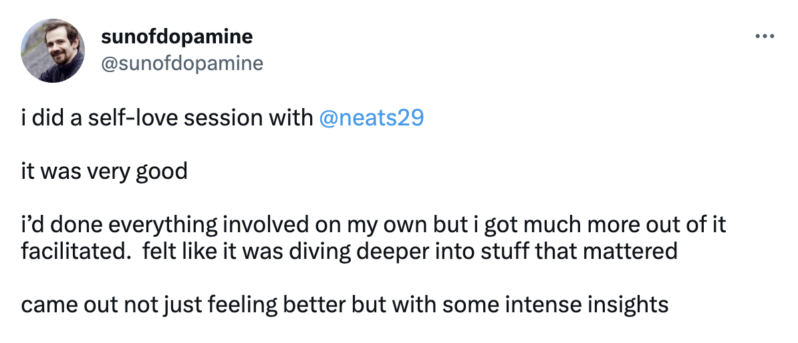
</img>

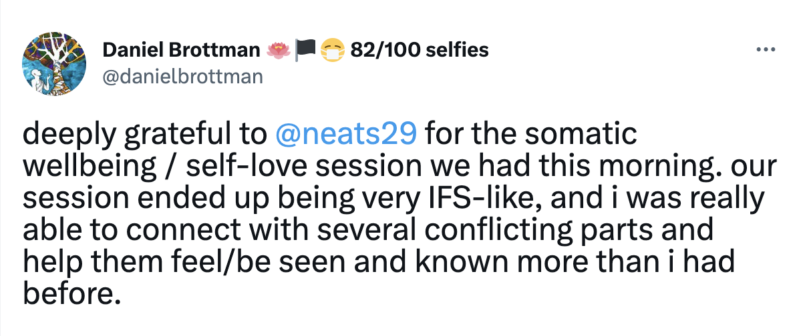
</img>

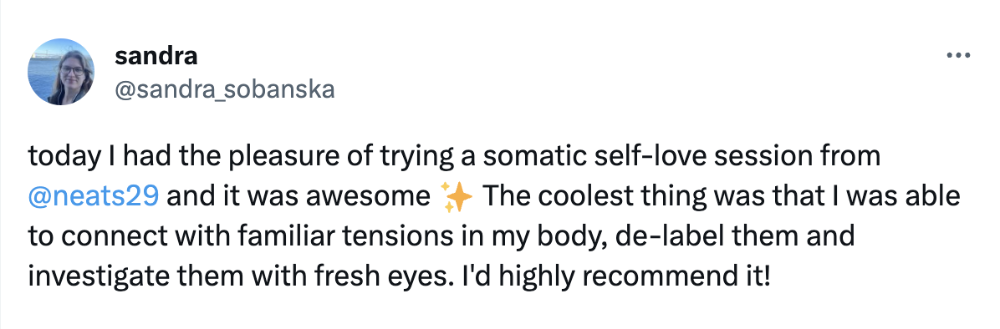
</img>

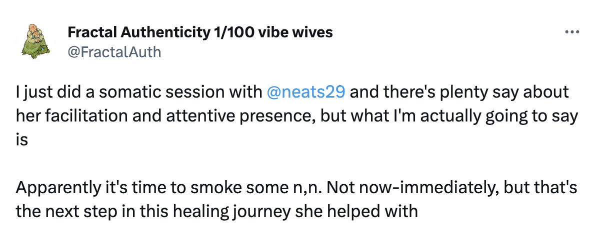
</img>

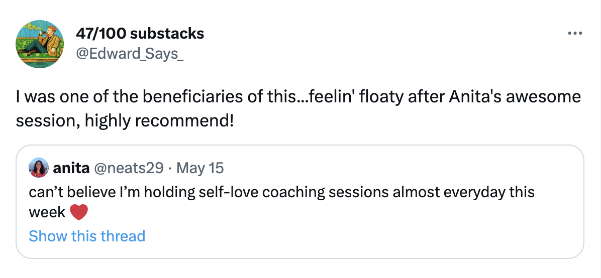
</img>

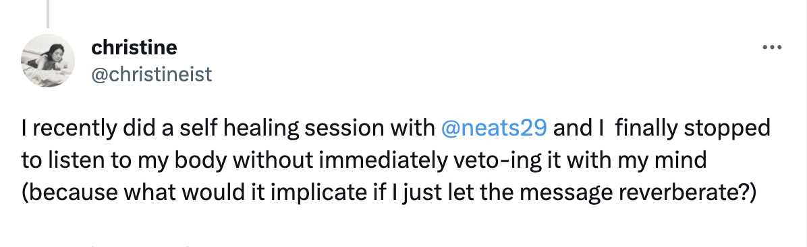
</img>

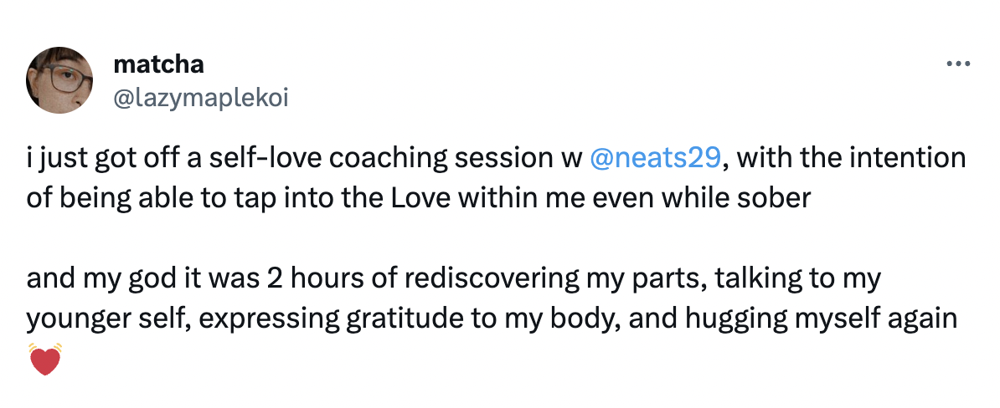
</img>

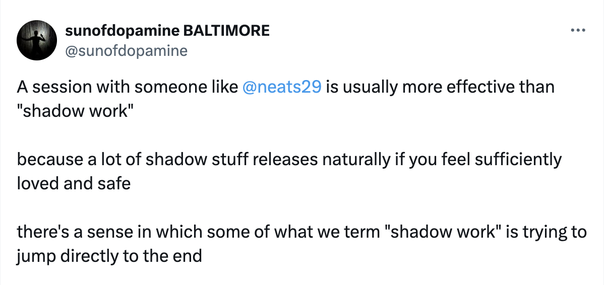
</img>

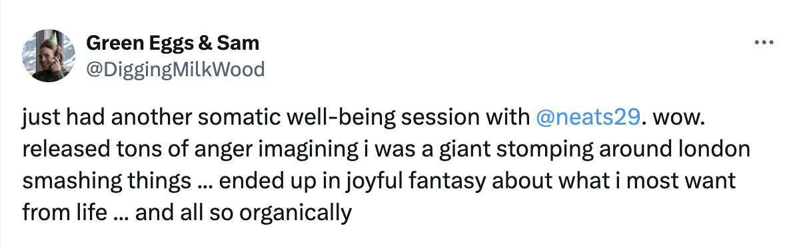
</img>

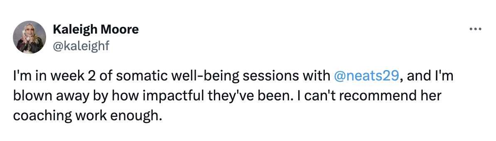
</img>

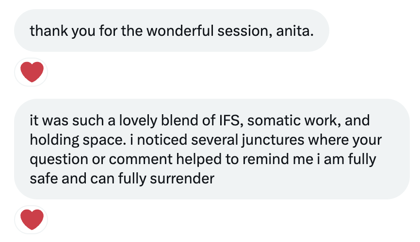
</img>
 
[Benjamin Haynes](https://twitter.com/Bee_Eye_
)

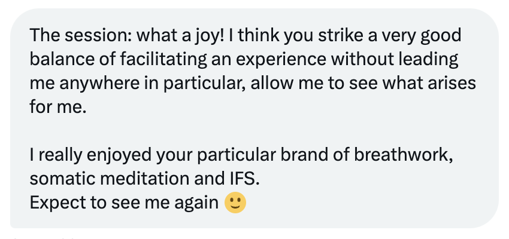
</img>
 
[Panashe M. Fundira](https://twitter.com/panafunds
)

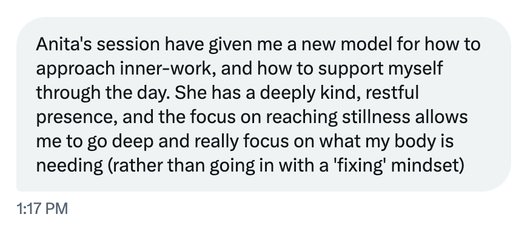
</img>
 
[@EgregoreGalore](https://twitter.com/EgregoreGalore)

<h1 style="font-size: 1.6em;">How can I book a session?</h1>

There are broadly two ways of working together:

- **Ongoing Exploration**: an open-ended series of sessions for those looking to dive deeper and explore their parts and emotions. Regular clients report increased emotional fluidity, a greater capacity to be with difficult emotions and more compassion for themselves.

    Here's a client describing the specific benefits they gained by working with me over the space of a few months:

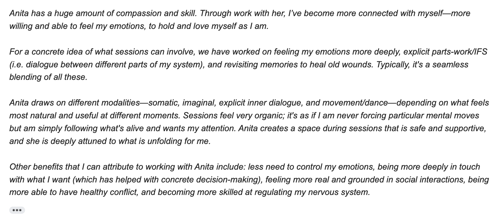
</img>

- **One-off Experience**: for those looking to experience this flavour of inner work. It's an opportunity to connect with your internal parts and work with difficult emotions, or even deepen into pleasurable ones. The purpose is to get a taste for the session and see if you'd like to continue working together.

You may [book a free intro call](https://cal.com/neats/intro) where we will discuss working together and book your first call. You may also [DM me on twitter](https://twitter.com/neats29) with any questions or to request a session.

Sessions are done on a video call.

**Session duration:**
1hr30mins on average

**Sliding Scale:**
£75—£100

The sliding scale is to accommodate different affordability levels. You may choose a value in this range that feels good to you.

<h1 style="font-size: 1.6em;">How can I best prepare for a session?</h1>

- Most sessions are done laying down (bed/sofa/floor etc) to enable deep relaxation. Please arrange this before the session so that the laptop camera is pointing towards you to show your face and torso. We will have a brief chat at the start of the call and then I will invite you to lay down. Most people remain in this position for the rest of the session, however you are welcome to move however you like during the session. If laying down isn't feasible or preferable, then you may do the session sitting down in a comfortable seat.

- Please wear a pair of headphones so I can hear you well, when laying down away from the laptop, the sound can become muffled.

- It's best not to have a hard stop after the session to allow a gentle transition into the rest of your day. If you have a hard stop please let me know at the start of the session so I can ensure the ending is not abrupt.

<h1 style="font-size: 1.6em;">Self-love guided meditation</h1>

<iframe width="560" height="315" src="https://www.youtube.com/embed/_PRMvBA6dQ8?si=QT5q6puQwGy9KsW_" title="YouTube video player" frameborder="0" allow="accelerometer; autoplay; clipboard-write; encrypted-media; gyroscope; picture-in-picture; web-share" allowfullscreen></iframe>

 

<h1 style="font-size: 1.6em;">Podcast appearances</h1>

If you'd like to hear more about my self-love journey and this work, you can listen to The Examined Life podcast with Khe Hy.

<iframe style="border-radius:12px" src="https://open.spotify.com/embed/episode/6MSODcs4qfBjtaXLPoUqJm/video?utm_source=generator" width="496" height="279" frameBorder="0" allowfullscreen="" allow="autoplay; clipboard-write; encrypted-media; fullscreen; picture-in-picture" loading="lazy"></iframe>

 

<iframe width="560" height="315" src="https://www.youtube.com/embed/TNDjemBYahc?si=xA9nreQJd8yntfDv" title="YouTube video player" frameborder="0" allow="accelerometer; autoplay; clipboard-write; encrypted-media; gyroscope; picture-in-picture; web-share" referrerpolicy="strict-origin-when-cross-origin" allowfullscreen></iframe>

---
If you have any questions, please send me message on [twitter](https://twitter.com/neats29).
