<h1 style="font-size: 1.1em; font-style:italic">A space to feel, heal, and understand yourself more deeply.</h1>

At the core of what causes dissatisfaction in our lives is often a young part of us frozen in time, holding a painful belief about itself or the world.

You could think of our work together as a treasure hunt. We’ll use your pain points in life as breadcrumbs to find these young parts, and bring them back home. Over time, you will experience more freedom, empowerment and joy.

Book a [free discovery call here](https://cal.com/neats/intro) or read below for more information.

<h1 style="font-size: 1.6em;">About me</h1>

</img>

I have been offering 1:1 IFS sessions professionally since the Spring of 2023. I am an IFS-informed practitioner trained by IFSCA. I have also completed many courses with the Art of Accomplishment since 2020 (including two year-long programmes).

Thus far, I have facilitated almost **900 hours** of sessions.

I view doing my own inner work as essential for holding space for others, so I take this very seriously; receiving weekly IFS therapy, group consults, peer coaching, meditative dance practice, year-long programmes with the Art of Accomplishment (Joe Hudson) and attending silent meditation retreats.

<h1 style="font-size: 1.6em;">How does it work?</h1>

IFS (Internal Family Systems) sessions are a bit different from talk therapy or regular coaching. Instead of conversing most of the session, I will invite you to turn inwards to notice emotions, body sensations, thoughts and/or internal visual imagery and share what comes up.

From there, a moment from your past may surface that's holding a difficult emotion or belief; frozen, because either it wasn't witnessed or the emotional arc couldn't complete. 

In these sessions, we offer the witnessing and completion that was needed. Once this happens, the pattern either dissolves completely or a new layer surfaces to be witnessed. My role is to help you stay connected to your own wisdom and follow this organic process.

<h1 style="font-size: 1.6em;">How to book a session</h1>

Please book a [free discovery call here](https://cal.com/neats/intro) to get to know each other and see if we're a good fit. From there, you can book a single session and decide afterwards whether to continue. You can also [DM me on twitter](https://twitter.com/neats29) with questions or to book a session without a discovery call.

**Duration:**
sessions are around **90 minutes**, done via video call. Please let me know if you have a hard stop.

**Investment:** £100 

<!-- **Note:**
IFS sessions are a bit different from talk therapy or regular coaching. Instead of us talking most of the session, I will invite you to turn inwards to notice emotions, body sensations, thoughts and/or internal visual imagery and share what comes up. My role is to help you stay connected to your own wisdom. -->

<h1 style="font-size: 1.6em;">Testimonials</h1>

(Please note, these sessions used to be called self-love coaching)

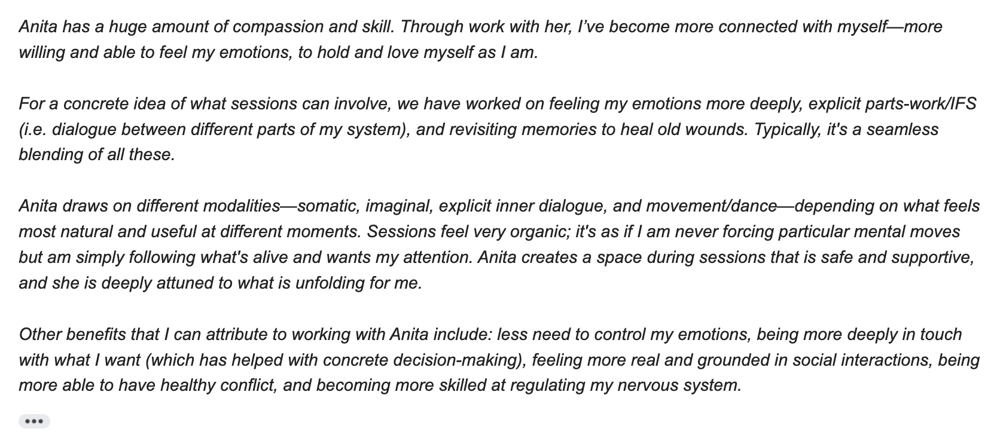
</img>

> "anita is one of the best facilitators i have worked with. she made it easy to trust her process so i could focus on what was going on inside of me. i was grateful to have her help in guiding my attention, and especially her use of breathwork. months later i still think back to what she helped me discover in our sessions and use it for making decisions in life" — [Mycelium Mage](https://twitter.com/myceliummage)

> "After following Anita's journey into self-love and nervous system regulation for a while now, I finally had the opportunity to experience what she's learned, and it was really, really nice. Going into it I was pretty jittery and didn't know what to expect, but she held such a warm space and a kind presence and it helped me understand what she's moving towards. I left the session feeling much more in tune with my body, and what it meant to love myself, and to use the breath and my feelings to take me deeper into that experience. I've been continuing to use what I learned in that session since, practicing box breathing and making space for my feelings and showing them affection." — [Anansi](https://twitter.com/s0ulDirect0r)

> "Anita has a really special energy. She is so warm, loving, attentive, intelligent, and clearly passionate about this work. I felt very held and cared for in our session, in which she blended IFS therapy, breathwork, and light touch into her own unique format. I think she's a perfect fit for healing work." - [Jane Miller](https://twitter.com/joespurpleshirt)

> "There's a story that some of us who have met Anita tell others: when you are speaking with her it feels like she will listen and accept anything and everything you have to say. It's something you can't force or fake. Her countenance, persence, and empathy gives you permission and space to feel into where you are right now. Her self-love coaching sessions is the epitome of this because she is there with you to inquire where you are and allow whatever needs to pass through, pass through you. I no longer have to be scared or lost in discovering things about myself anymore, knowing Anita will be there when I need her to be." — [Minnow Park](https://twitter.com/minnowpark)

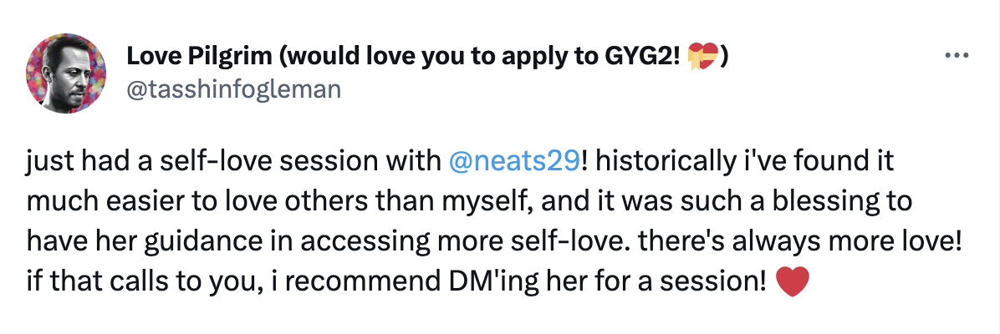
</img>

</img>

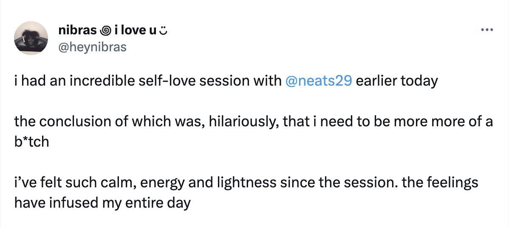
</img>

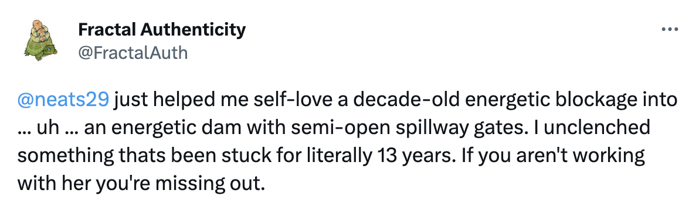
</img>

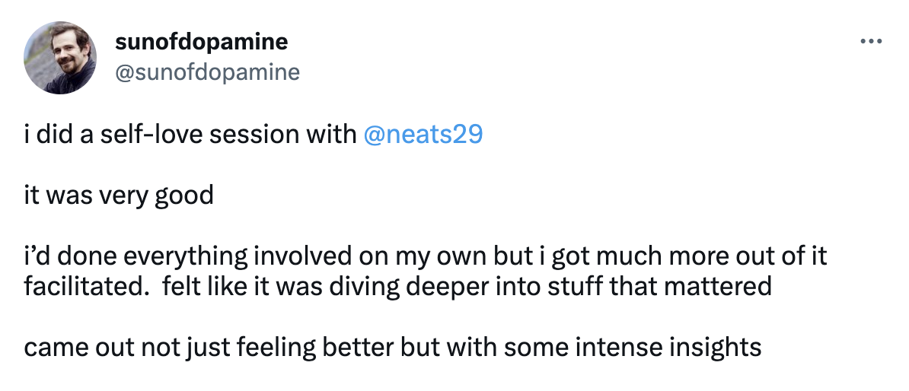
</img>

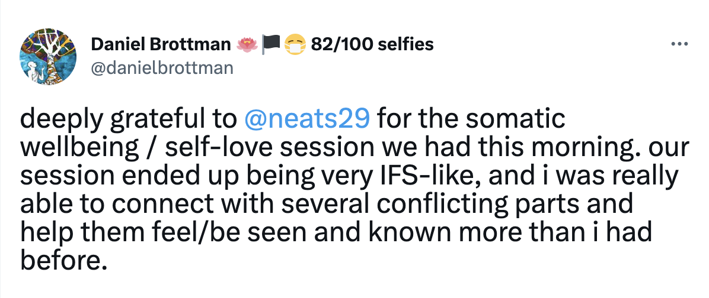
</img>

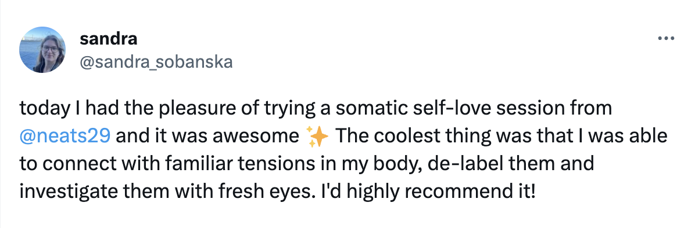
</img>

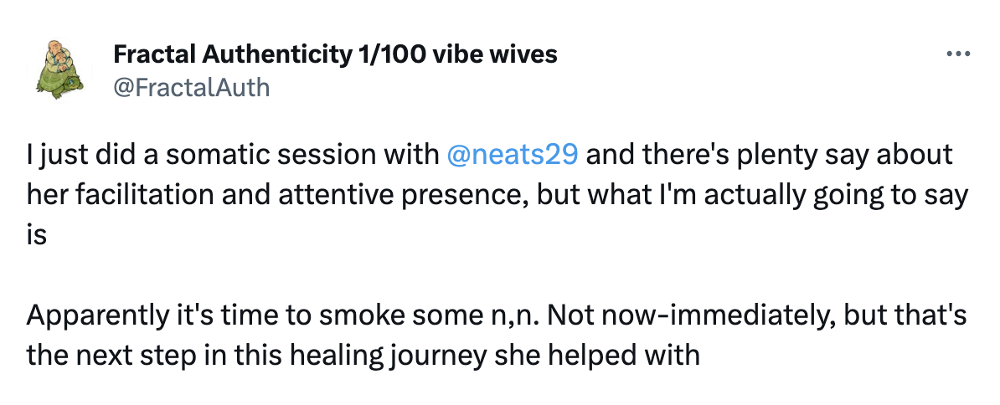
</img>

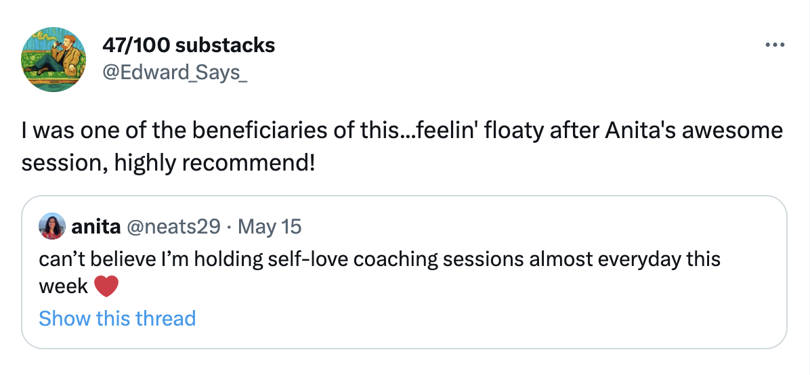
</img>

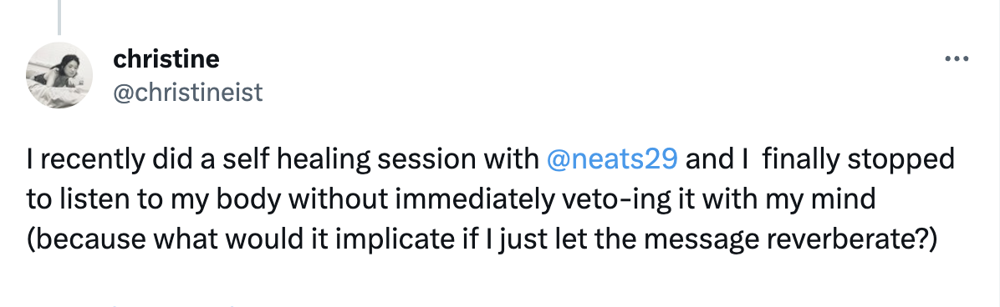
</img>

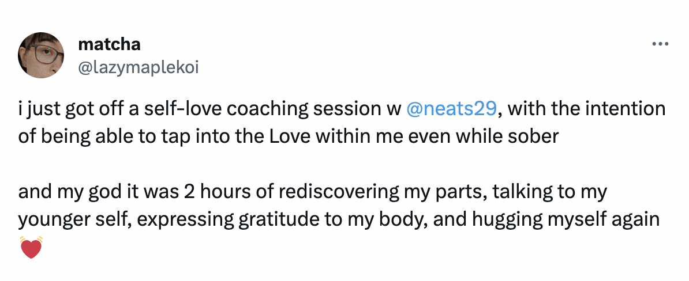
</img>

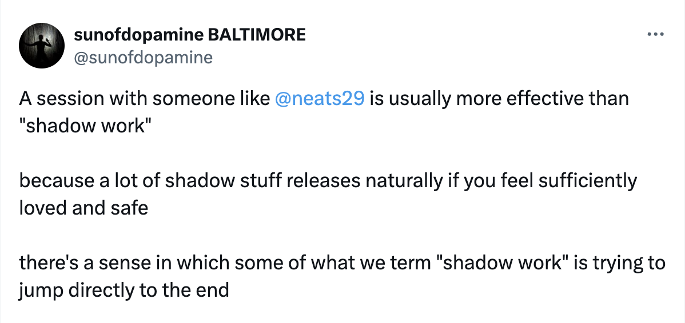
</img>

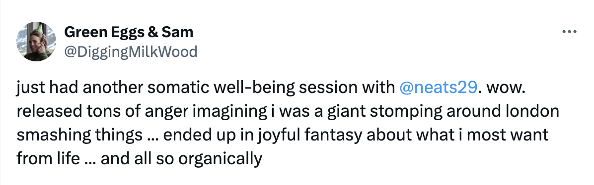
</img>

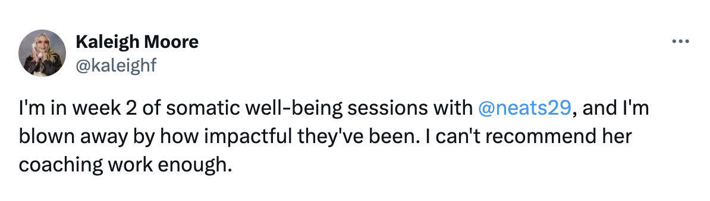
</img>

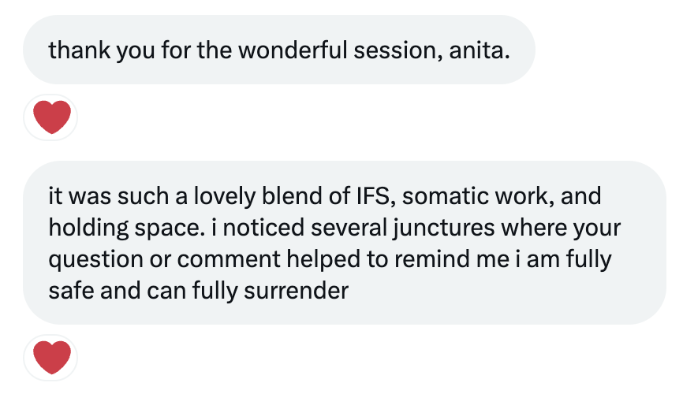
</img>
 
[Benjamin Haynes](https://twitter.com/Bee_Eye_
)

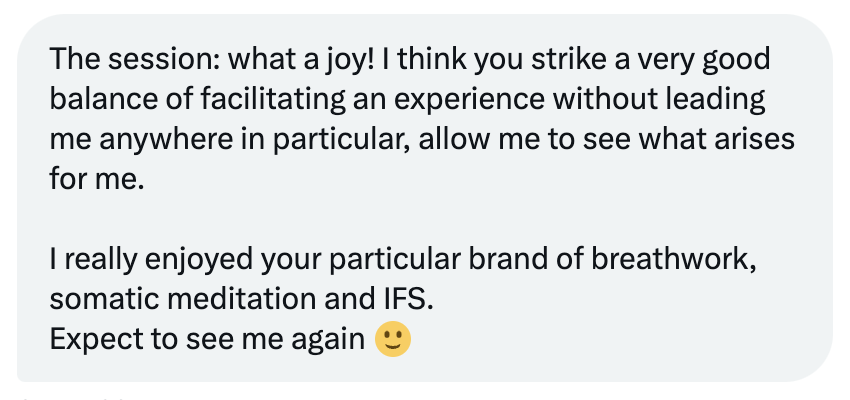
</img>
 
[Panashe M. Fundira](https://twitter.com/panafunds
)

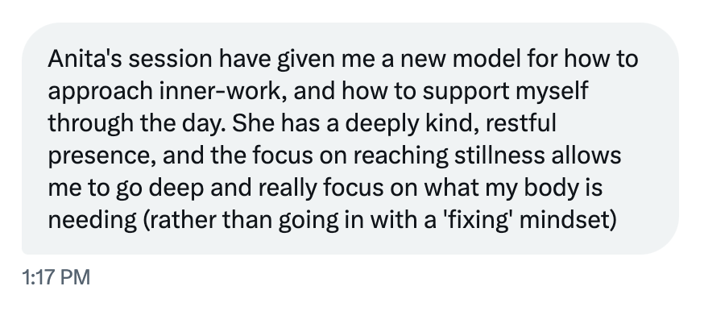
</img>
 
[@EgregoreGalore](https://twitter.com/EgregoreGalore)

<h1 style="font-size: 1.6em;">Disclaimer</h1>

By booking a session, you acknowledge that I am not a licensed mental health professional, psychotherapist, or medical provider. Sessions are for personal growth and emotional support, not psychotherapy, counselling, or mental health treatment.

<h1 style="font-size: 1.6em;">Self-love guided meditation</h1>

<iframe width="560" height="315" src="https://www.youtube.com/embed/_PRMvBA6dQ8?si=QT5q6puQwGy9KsW_" title="YouTube video player" frameborder="0" allow="accelerometer; autoplay; clipboard-write; encrypted-media; gyroscope; picture-in-picture; web-share" allowfullscreen></iframe>

 

---
If you have any questions, please send me message on [twitter](https://twitter.com/neats29).
