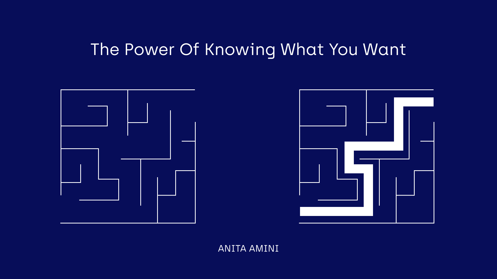
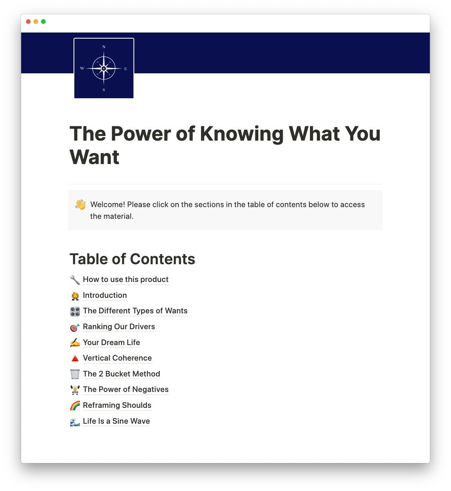

<!-- 
</img>

<h1 style="font-size: 1em;">Learn to gain clarity on what you truly want and achieve your goals systematically</h1>

Over the years I've developed a system to identify what I truly want and achieve those wants consistently. This has deeply enriched my life. Now, I'm distilling all of that to share it with you.  -->

<!-- Sign up to get notified when the course is ready!

⚠️ Check your **promotions** inbox on Gmail.

 -->

<a href="https://gumroad.com/l/pkwyw">Loading...</a>

<!-- <h1 style="font-size: 1.3em;">Why is Knowing What You Want Important?</h1> -->

<!-- Our actions are driven by different, often opposing wants. They have the power to either lead us astray or towards the life we truly want. Many people are not fully aware of the influences that cause them to make decisions that are often not in their favour. 

- Where do these influences come from?
- How could we discover and extract the ones that really matter to us?
- How could we live on our own terms rather than being influenced by unconscious conditioning?

Figuring out what you truly want is one of the highest leverage tasks you could do towards fulfillment. The opportunity cost of living life without clarity is astronomical. Think of all the time wasted on the wrong projects, the wrong people, and the wrong purchases.

This course is a Notion dashboard that will walk you through a set of exercises to decipher your wants and drivers. Once you have identified the life you _really_ want, you will learn how to connect the future you'd like to your present-day, develop habits and achieve your goals. -->

<!-- 
</img>

<h1 style="font-size: 1.3em;">Who is This For?</h1> -->

<!-- - you suffer from shiny object syndrome
- you are frustrated by the inability to finish your projects
- you lack direction or feel you could be more intentional about where you are headed
- you are struggling to stay on track with your goals
- you want to decipher what you really want in life
- you would like to have a system that lets you identify how to make the most of your time and achieve your goals -->

