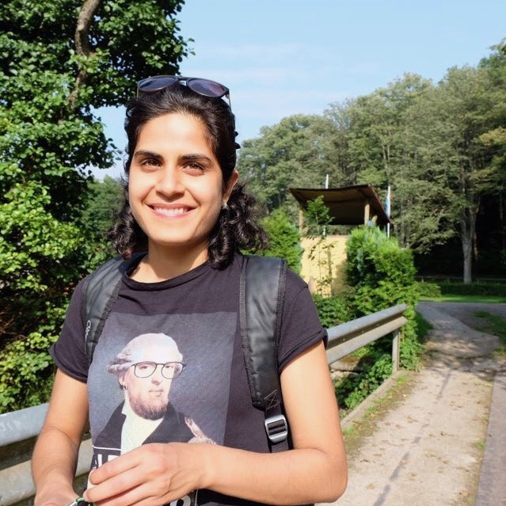

</img>

My name is Anita Amini and I’m a Software Engineer in London. I love learning, climbing and deep conversations.

__My favourite thing is to learn, in order to live life intentionally. My second favourite thing is to distill that information and share my experience with others; hence this blog 😀.__

I work at a UK-based online pharmacy startup called [Echo](https://echo.co.uk/), which delivers prescriptions free of charge. I write in the programming languages [Go](https://golang.org/) and [Javascript](https://www.javascript.com/). Prior to that, I was working in the blockchain space, building applications on [Ethereum](https://www.ethereum.org/).

---

<h1 style="font-size: 1.4em;">The Curious Bunch</h1>

I organise a monthly meetup for the kind and curious, you can sign up to hear about future events [here](../curious-bunch).

---

<h1 style="font-size: 1.4em;">Fun Facts</h1>

- I was born in Iran 🇮🇷, we later moved to London when I was 10 

- I studied Pharmaceutical Science at university, but I changed careers in 2015 by learning to code at [Founders & Coders](https://www.foundersandcoders.com/) – the most life altering decision of my life!

<!-- - My favourite thinkers are:
  - [Naval](https://twitter.com/Naval), 
  - [Sam Harris](https://twitter.com/SamHarrisOrg), 
  - [Yuval Noah Harari](https://twitter.com/harari_yuval), 
  - [Tim Urban](https://twitter.com/waitbutwhy) and 
  - [Tim Ferriss](https://twitter.com/tferriss). -->
- The best places I've visited: 
  - Torres del Paine (Patagonia) in Chile 🇨🇱
  - Hakone in Japan 🇯🇵
  - Los Roques in Venezuela 🇻🇪
  - Bryce Canyon and Zion Park in USA 🇺🇸
  - Weligama and Mirissa in Sri Lanka 🇱🇰

- Superpower – __picking up new skills and habits fast__:
  - Secured my first coding job 7 months after I started learning to code
  - Broke into the blockchain space by learning about it in my spare time
  - Went from not reading at all until the age of 21, to becoming a book worm

---

<h1 style="font-size: 1.4em;">Top Posts</h1>

👩‍💻 Career Management:

- [Figuring Out What to Do With Your Life](/figuring-life-out-p1)
- [How to Thrive in the Age of Change](/thrive-in-change)
- [Barking up the Wrong Tree (book summary on the science of success)](/barking)

💪 Personal Development:

- [My Psychedelic Journey to Self-Compassion ](/self-compassion)
- [How to Overcome Imposter Syndrome](/imposter-syndrome)
- [On Shedding Identity](/identity)

🧠Intellectual Curiosity:

- [Wait But Why: The Story of Us – Summary of Part 1](/story-of-us)
- [2019's Best Podcast Episodes For the Curiously Minded](/top-podcasts-2019)
- [Podcasts that Make a Lasting Impact](/podcasts)

 

---

<h1 style="font-size: 1.4em;">Distilled</h1>

If you are interested in learning together with me, I have a newsletter called [__Distilled__](/subscribe) where I share my learnings.

 <!-- Mailchimp Signup Form -->
 

    <form action="https://infodistillery.us20.list-manage.com/subscribe/post?u=23c86deb696792ce7c4cfac07&amp;id=7378bd40fd" method="post" id="mc-embedded-subscribe-form" name="mc-embedded-subscribe-form" class="validate" target="_blank" novalidate>
      

          

              <input type="text" style="width: 50%;" name="FNAME" class="" id="mce-FNAME" placeholder="First Name">
              

                <input type="email" style="width: 50%;" name="EMAIL" class="email" id="mce-EMAIL" placeholder="Email Address *" required>
                

                  <!-- real people should not fill this in and expect good things - do not remove this or risk form bot signups-->
                  
<input type="text" name="b_23c86deb696792ce7c4cfac07_7378bd40fd" tabindex="-1" value="">

                  
<input type="submit" value="Sign up" style="margin-left: 20px;" name="subscribe" id="mc-embedded-subscribe" class="button">

                

              

               
              

                

                

              

          

          

    </form>
    
 

<!--End mc_embed_signup-->
---

<h1 style="font-size: 1.4em;">Connect With Me</h1> I’d love to connect on [Twitter](https://twitter.com/neats29) or meet IRL.